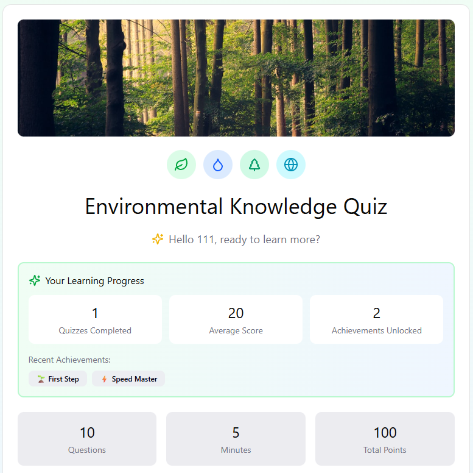

# EPE

A modern, interactive web application built with React and Vite.

## 🌐 Live Demo

Visit the live site: [https://DYR-0.github.io/EPE/]

## Screenshots
   

## ✨ Features

- Modern, responsive design
- Interactive user interface
- Fast performance with Vite
- Built with React 18

## 🛠️ Technologies

- **React** - UI framework
- **Vite** - Build tool and dev server
- **TypeScript** - Type safety
- **Tailwind CSS** - Styling
- **Radix UI** - Accessible components

## 💻 Local Development

To run this project locally:

```bash
# Install dependencies
npm install

# Start development server
npm run dev
```

The site will be available at `http://localhost:3000`

## 🏗️ Build

To build for production:

```bash
npm run build
```

## 📝 License

This project is open source and available under the MIT License.

## 👤 Author

Qiuya Chen
Yirong Ding
Lihua Fu
Zehong Wang

---

Made with ❤️ using Figma
